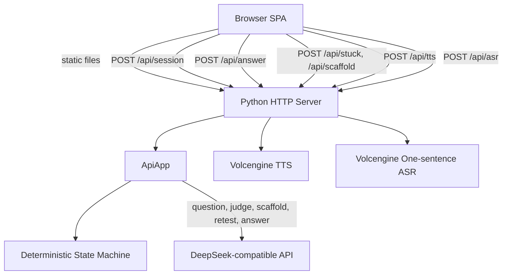
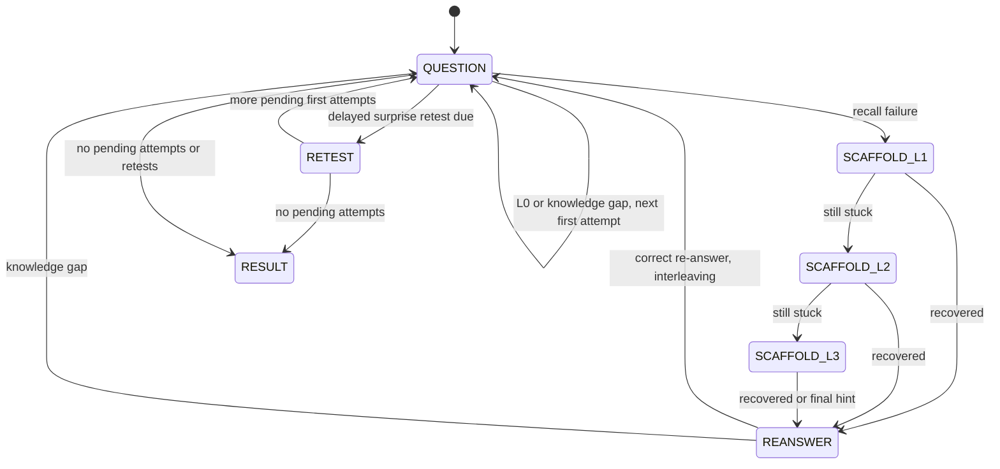

# Architecture

## System Overview



## State Machine



## Responsibility Split

Program-controlled:

- Session creation.
- Question order.
- Scaffold level transitions.
- Re-answer requirement.
- Retest scheduling.
- Result summary shape.

LLM-assisted:

- High-frequency backend interview question generation.
- Recall sufficiency judgment.
- L1/L2/L3 scaffold text.
- Retest question generation.
- Concise Knowledge Gap answer.

## API Surface

- `POST /api/session`: create a training session.
- `POST /api/answer`: submit text or voice transcript answer.
- `POST /api/stuck`: enter L1 scaffold.
- `POST /api/scaffold`: advance scaffold or mark recovery.
- `GET /api/result?sessionId=...`: fetch final summary.
- `GET /api/voice-status`: report optional voice service configuration.
- `POST /api/tts`: synthesize interview prompt audio.
- `POST /api/asr`: transcribe a recorded voice answer.

## Deployment Shape

```text
User browser
-> public HTTP endpoint http://43.132.173.100
-> Python server on port 80
-> DeepSeek API for LLM content
-> Volcengine API for optional voice services
```

No database is required for the MVP. Sessions are held in memory because the competition demo only needs a short interactive flow.
